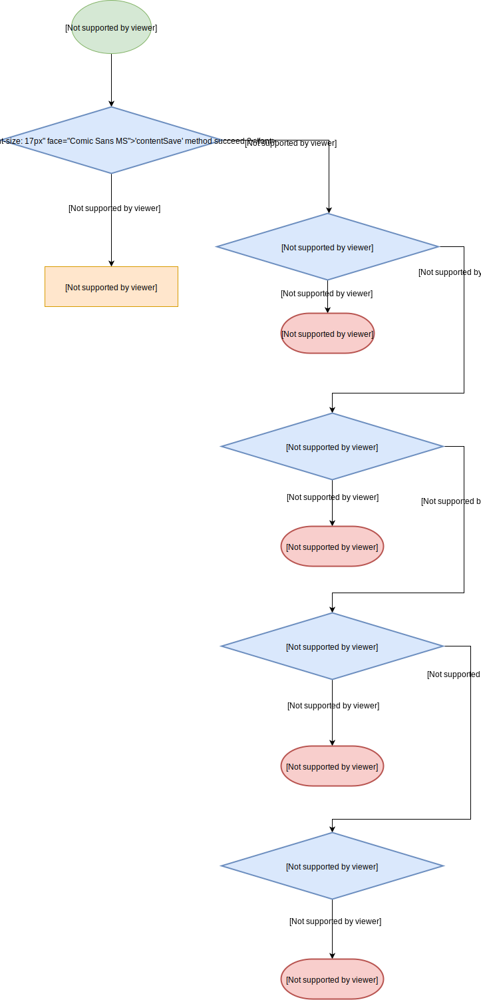
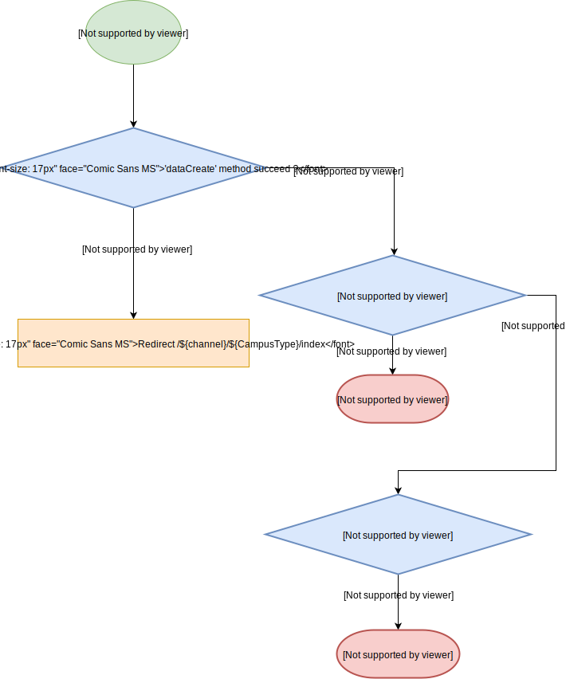
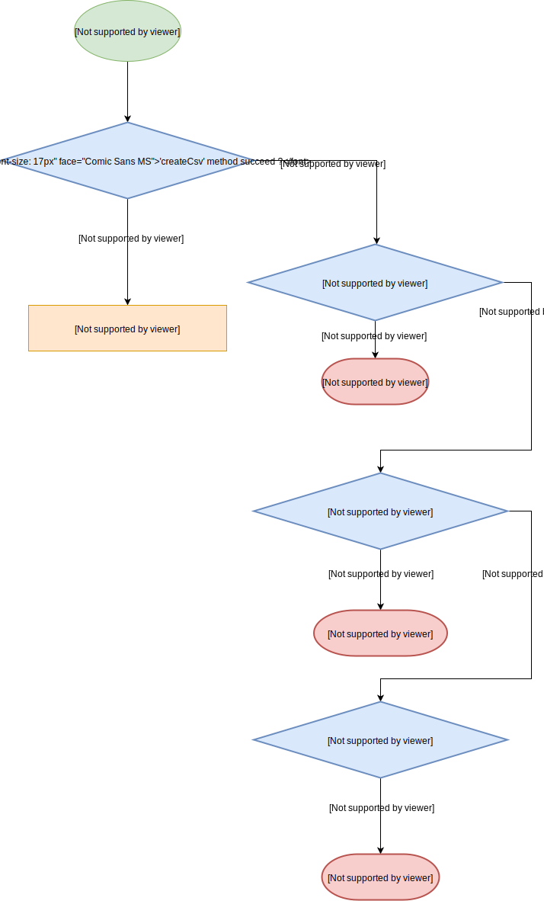
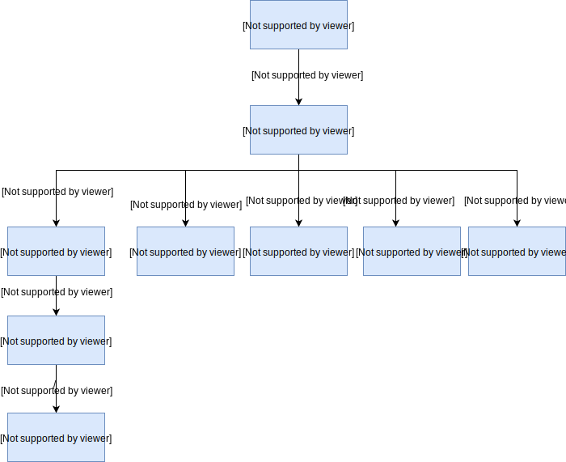
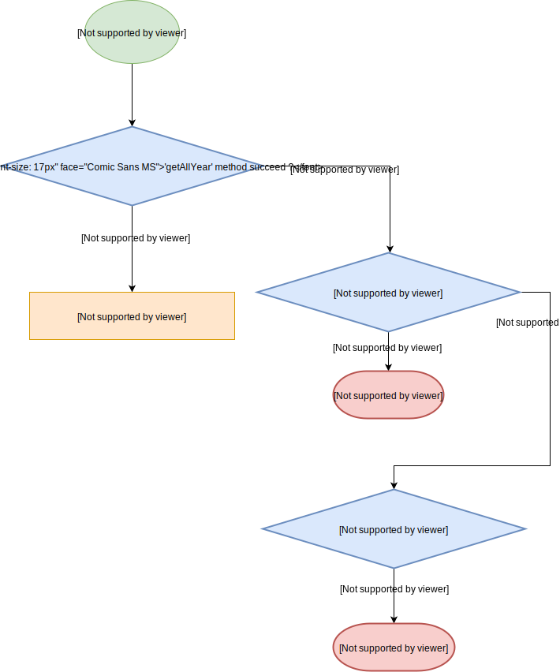

# Selection Web
A website which is for management and data marker.

# Index
- <a href='#prerequisite'> Prerequisite </a>
- <a href='#hiOfSelection'> Hierarchy Of Selection Web </a>
- <a href='#auth'> auth </a>
    - <a href='#auth_models'> auth/models </a>
    - <a href='#auth_public'> auth/public </a>
    - <a href='#auth_static'> auth/static </a>
    - <a href='#auth_views'> auth/views </a>
    - <a href='#auth_app'> auth/app.js </a>
- <a href='#mid'> mid-long-term </a>
    - <a href='#mid_models'> mid-long-term/models </a>
    - <a href='#mid_public'> mid-long-term/public </a>
    - <a href='#mid_static'> mid-long-term/static </a>
    - <a href='#mid_routes'> mid-long-term/routes </a>
    - <a href='#mid_views'> mid-long-term/views </a>
    - <a href='#mid_app'> mid-long-term/app.js </a>
- <a href='#short'> short-term </a>
    - <a href='#short_models'> short-term/models </a>
    - <a href='#short_public'> short-term/public </a>
    - <a href='#short_static'> short-term/static </a>
    - <a href='#short_routes'> short-term/routes </a>
    - <a href='#short_views'> short-term/views </a>
    - <a href='#short_app'> short-term/app.js </a>

<a id="prerequisite"></a>

# Prerequisite
- Node js
    - Express
- Sequelize
- HTML/CSS
    - Pug
    - Scss
- Webpack

<a id="hiOfSelection"></a>

# Hierarachy of Selection web
```bash
selection_Web/
├── data
├── auth
├── mid-long-term
├── short-term
├── doc
└── lib
```
This project has three apps, named `auth`, `mid-long-term`, `short-term`, respectively.

<a id='auth'></a>

# `auth`
The `auth` app handles the operation of login.

```bash
auth
├── models
│   ├── operations
│   └── schemas
├── public
│   ├── javascripts
│   └── stylesheets
├── static
│   ├── javascripts
│   └── stylesheets
│       └── component
├── views
│   └── mixins
└── app.js
```
- links
    - <a href="#auth_models"> models </a>
    - <a href="#auth_public"> public </a>
    - <a href="#auth_static"> static </a>
    - <a href="#auth_views"> views </a>
    - <a href="#auth_app"> app.js </a>

<a id='auth_models'></a>

- `auth/models`

    - `models/operations`, which defines the connection between the database and server by using `Sequelize` modules.
        - [`connect.js`](https://hackmd.io/SHKrnas3SHOuMzQ6nbZK1w?both)
        - [`sync-session.js`](https://hackmd.io/Ok-YiwE4SLeCf5f9ltTE5w)
        - [`delete-sission.js`](https://hackmd.io/Y03A1JwzReijkrYLZCfzcQ)
        - [`get-user-info.js`](https://hackmd.io/byoZCcCqSnCdF3GTKF_e5g?both)
        - [`login.js`](https://hackmd.io/sx3VxGASSaibHE4KvfvICg)
    - `models/schemas`, which defines the columns and properties of each column. We have schemas named `session` and `user`.
        - [`session.js`](https://hackmd.io/DQccnW8GSU6i6-XpGE9JIQ)
        - [`user.js`](https://hackmd.io/_7pcP-nHT3G8dl8ZSKUJgw)

<a id="auth_public"></a>

- `auth/public`
    - It is just the bundle of front-end code which is not readable.

<a id="auth_static"></a>

- `auth/static`

    - `auth/static/javascripts`
        - It defines the function of login and signup.
        - [`login.js`](https://hackmd.io/kw0LaJzeRjyIZy0-j0IXAQ)
        - [`signup.js`](https://hackmd.io/bEv5a2MCTi2XsW0CHvEkyA)

    - `auth/static/stylesheets`
        - It defines the exterior of the web page
        - `component/`
            - `_manage.scss`
            - `_style.scss`
        - `signup.css`
        - `login.css`
        - `signup.css`

<a id="auth_views"></a>
- `auth/views`
    - This defines the html of login web page and signup web page.

<a id="auth_app"></a>

- [`app.js`](https://hackmd.io/iBpjWIvnRqK8eAmIUpLDXQ#module_userApp..login)
    - This is the server, which defines the operation of login and signup.

    - Route
        - `POST /login` - only can be requested from GET `/login` page
        
        - `GET /login` - could be from any page
        
        - `/public` - could be from any page
        
        - `GET /channel` - could be from any page
        
        - `GET /logout` - could be get from `/channel`, `mid-long-term/` and `short-term/`
        

<a id='mid-long-term'></a>

# `mid-long-term`

```bash
mid-long-term/
├── models
│   ├── operations
│   └── schemas
├── public
│   ├── javascripts
│   └── stylesheets
├── routes
├── static
│   ├── javascripts
│   │   ├── module
│   │   └── src
│   └── stylesheets
│       └── component
├── views
│    └── mixins
│        └── editnodes
└── app.js
```
<a id='mid_models'></a>

- `mid-long-term/models`
    - `/operations`, which defines the connection between the database and server by using `Sequelize` modules and deines the operations to the database.
        - connection
            - [`connect.js`](https://hackmd.io/9ERaXWGLRCuxHzBtrFiGiA)
        - operations
            - [`content-auth.js`](https://hackmd.io/iiao7-TCTKqyx_VPizSxgw)
            - [`content-change-label.js`](https://hackmd.io/n_0lDpKORDKV_0BQGeFW0A)
            - [`content-create.js`](https://hackmd.io/Yjuql7JmTeOBSv6kswfObQ)
            - [`content-update.js`](https://hackmd.io/wJrvIgXzQH-psws782e3oA)
            - `content-filter.js`
            - [`data-create.js`](https://hackmd.io/5vrrDLjKS16q8Rxwht_8cg)
            - [`data-delete.js`](https://hackmd.io/CdTK5J6CSFiTkCf30wiNqQ)
            - [`download-csv.js`](https://hackmd.io/dHAEUp3KT9WU4eQ5YdpnuA)
            - `draw.js` (deprecated)
            - [`get-all-campus.js`](https://hackmd.io/nbl4ko22QYO1jV2NCBqstg)
            - `get-all-year.js`
            - `get-all-type.js`
            - `get-content.js`
    - `/schemas`
        - which defines the columns and properties of each column. We have schemas named `content` and `data`.
        - `data.js`
            - It represent the campus.
        - `content.js`
            - It represent the content of campus.
<a id='mid_public'></a>

- `mid-long-term/public`
    - It is just the bundle of front-end code which is not readable.
<a id='mid_static'></a>

- `mid-long-term/static`

    - `/javascripts`
        - It defines the function of creating new campus and buttons on the web page.

        - ```bash
            javascripts/
            ├── campus.js
            ├── draw.js
            ├── edit.js
            ├── module
            │   ├── projectCreation.js
            │   └── projectDelete.backup.js
            ├── review.js
            ├── src
            │   └── schema.js
            ├── type.js
            └── year.js
            ```

        - `campus.js`
            - Just import the `projectCreation.js`.

        - `draw.js` (deprecated)
            - Define the figure drew on the web page.
        - `edit.js`
            - Define the function of the  filter and dropdown button in the edit mode when the user owns the edit permission. Otherwise, the user only has the permission to read.
        - `module/`
            - `projectCreation.js`
                - It will be called when the users add a new campus to the database.
            - `projectDelete.backup.js`
                - It will be called when the users want to delete a campus(project)

        - `review.js`
            - Define the function of the filter and dropdown button in the read-only mode when the user doesn't own the edit permission.
        - `src/schema.js`
            - Containing a object with the label information.(It is used to control the dropdown button)
        - type.js
            - Import `projectCreation.js`.
        - year.js
            - Import `projectCreation.js` and the function of progress bar.

    - `/stylesheets`
        - It defines the exterior of the web page
        - `signup.css`
        - `login.css`
        - `signup.css`
<a id='mid_routes'></a>

- `mid-long-term/routes`
    - All routes of controlling the logic of responding and requesting
    - Hierarachy
        - ```bash
            routes/
            ├── campus.js
            ├── content.js
            ├── data.js
            ├── downloadCsv.js
            ├── graph.js
            ├── index.js
            ├── review.js
            ├── type.js
            └── year.js
            ```
    - `campus.js` - `GET midLongTerm/:typeId`
        - Controll the logic in the campus web page(.scss).
        
    - `content.js`-`midLongTerm/content`
        - Controll the logic in the edit web page(.scss).
        - `GET /save`
        
        - `GET /delete`
        
        - `GET /change`
        
        - `GET /:dataId`
        
        - `GET /:dataId/filter`
        
        - `GET /:dataId/check`
        
        - `POST /:dataId/check`
        
        - `GET /:dataId/add`
        
    - `data.js`
        - Controll the logic when the user add a new content or delete a content. And, it also has the function of rendering a edit web page when the users access the edit page.
        - `POST /add`
        
        - `POST /delete`
        
        - `/:dataId`
        
        - `POST /:dataId/edit`- only could be requested from `year.pug`
        
    - `downloadCsv.js`
        - Controll the logic when the user wants to download the current project into a csv file.
        - `downloadCsv/:dataId/index`
        
    - `graph.js`
        - Controll the logic when the user wants to see the statistic result of the campus.
    - `index.js`
        - Just render the `type.pug` page to the client.
    - `review.js`
        - Controll the logic of reviewer or editor. If the user is the owner, it will redirect to the `data.js`. Otherwise, it will render a `review.pug`
        - GET /check
        
        - GET /conflict
        
        - GET /:dataId
        
        - GET /:dataId/filter
        
        - GET /:dataId/index
        
    - `type.js`
        - Sending the web page,`type.pug`, with all types of campuses to the client.
        - GET `/index`
        
    - `year.js`
        - Sending the web page, `year.pug`, with all years of campuses to the client.
        - GET `/index`
        
<a id='mid_views'></a>

- `/views`
    - All web pages of mid-long-term are here.
    - Hierarachy
        - ```bash
            views
            ├── campus.pug
            ├── edit.pug
            ├── editwithfilter.pug
            ├── error.pug
            ├── graph.pug
            ├── mixins
            │   ├── _addbutton.pug
            │   ├── _breadcrumb.pug
            │   ├── editnodes
            │   │   ├── check.pug
            │   │   ├── newedit.pug
            │   │   ├── own.pug
            │   │   ├── packup
            │   │   └── review.pug
            │   ├── filter.pug
            │   ├── _filterthreefield.pug
            │   ├── layout.pug
            │   ├── _midlongcss.pug
            │   ├── _midlongjavascript.pug
            │   ├── _projectcreation.pug
            │   ├── _rendercampus.pug
            │   ├── _renderyear.pug
            │   └── _suredelete.pug
            ├── review.pug
            ├── type.pug
            └── year.pug
            ```
    - `campus.pus`
    - `edit.pus`
    - `editwithfilter.pug`
    - `error.pug`
    - `graph.pug`
    - `mixins/`
        - `_addbutton.pug`
        - `_breadcrumb.pug`
        - `editnodes/`
            - `check.pug`
            - `newedit.pug`
            - `own.pug`
            - `review.pug`
        - `filter.pug`
        - `_filterthreefield.pug`
        - `layout.pug`
        - `_midlongcss.pug`
        - `_midlongjavascript.pug`
        - `_projectcreation.pug`
        - `_rendercampus.pug`
        - `_renderyear.pug`
        - `_suredelete.pug`
        - `review.pug`
        - `type.pug`
        - `year.pug`
<a id='mid_app'></a>

- `app.js`
    - The main hub of all routes. It controll the flow of requesting and error handling.
    - This is the order of the routes
    

<a id='short-term'></a>
# short-term

```bash=
short-term
├── models
│   ├── operations
│   └── schemas
├── public
│   ├── javascripts
│   └── stylesheets
├── routes
├── static
│   ├── javascripts
│   │   ├── module
│   │   └── src
│   └── stylesheets
│       └── component
└── views
    └── mixins
        └── editnodes

```
<a id='short_models'></a>

- `short-term/models`
    - `/operations`, which defines the connection between the database and server by using `Sequelize` modules and deines the operations to the database.
        - connection
            - [`connect.js`](https://hackmd.io/9ERaXWGLRCuxHzBtrFiGiA)
        - operations
            - [`content-auth.js`](https://hackmd.io/iiao7-TCTKqyx_VPizSxgw)
            - [`content-change-label.js`](https://hackmd.io/n_0lDpKORDKV_0BQGeFW0A)
            - [`content-create.js`](https://hackmd.io/Yjuql7JmTeOBSv6kswfObQ)
            - [`content-update.js`](https://hackmd.io/wJrvIgXzQH-psws782e3oA)
            - [`data-create.js`](https://hackmd.io/5vrrDLjKS16q8Rxwht_8cg)
            - [`data-delete.js`](https://hackmd.io/CdTK5J6CSFiTkCf30wiNqQ)
            - [`download-csv.js`](https://hackmd.io/dHAEUp3KT9WU4eQ5YdpnuA)
            - `draw.js` (deprecated)
            - [`get-all-campus.js`](https://hackmd.io/nbl4ko22QYO1jV2NCBqstg)
            - [`get-all-year.js`](https://hackmd.io/EWG0hIs-SHug3h89SkVEzA)
            - [`get-all-type.js`](https://hackmd.io/R52LF6fJRBywRe12cAjalA)
            - [`get-content.js`](https://hackmd.io/4lyea_eIS-Osus-iYBKhZA)
    - `/schemas`
        - which defines the columns and properties of each column. We have schemas named `content` and `data`.
        - `data.js`
            - It represent the campus.
        - `content.js`
            - It represent the content of campus.

<a id='short_public'></a>

- `short-term/public`
    - It is just the bundle of front-end code which is not readable.
<a id='short_static'></a>

- `short-term/static`

    - `/javascripts`
        - It defines the function of creating new campus and buttons on the web page.

        - ```bash
            javascripts/
            ├── campus.js
            ├── draw.js
            ├── edit.js
            ├── module
            │   ├── projectCreation.js
            │   └── projectDelete.backup.js
            ├── review.js
            ├── src
            │   └── schema.js
            ├── type.js
            └── year.js
            ```

        - `campus.js`
            - Just import the `projectCreation.js`.
        - `draw.js` (deprecated)
            - Define the figure drew on the web page.
        - `edit.js`
            - Define the function of the  filter and dropdown button in the edit mode when the user owns the edit permission. Otherwise, the user only has the permission to read.
        - `module/`
            - `projectCreation.js`
                - It will be called when the users add a new campus to the database.
            - `projectDelete.backup.js`
                - It will be called when the users want to delete a campus(project)

        - `review.js`
            - Define the function of the filter and dropdown button in the read-only mode when the user doesn't own the edit permission.
        - `src/schema.js`
            - Containing a object with the label information.(It is used to control the dropdown button)
        - type.js
            - Import `projectCreation.js`.
        - year.js
            - Import `projectCreation.js` and the function of progress bar.
    - `/stylesheets`
        - It defines the exterior of the web page
        - `signup.css`
        - `login.css`
        - `signup.css`
<a id='short_routes'></a>

- `short-term/routes`
    - All routes of controlling the logic of responding and requesting
    - Hierarachy
        - ```bash
            routes/
            ├── campus.js
            ├── content.js
            ├── data.js
            ├── downloadCsv.js
            ├── graph.js
            ├── index.js
            ├── review.js
            ├── type.js
            └── year.js
            ```
    - `campus.js`
        - Controll the logic in the campus web page(.scss).
        
    - `content.js`
        - Controll the logic in the edit web page(.scss).
        - `GET /save`
        
        - `GET /delete`
        
        - `GET /change`
        
        - `GET /:dataId`
        
        - `GET /:dataId/filter`
        
        - `GET /:dataId/check`
        
        - `POST /:dataId/check`
        
        - `GET /:dataId/add`
        
    - `data.js`
        - Controll the logic when the user add a new content or delete a content. And, it also has the function of rendering a edit web page when the users access the edit page.
        - `POST /add`
        
        - `POST /delete`
        
        - `/:dataId`
        
        - `POST /:dataId/edit`- only could be requested from `year.pug`
        
    - `downloadCsv.js`
        - Controll the logic when the user wants to download the current project into a csv file.
        - `downloadCsv/:dataId/index`
        
    - `graph.js`
        - Controll the logic when the user wants to see the statistic result of the campus.
    - `index.js`
        - Just render the `type.pug` page to the client.
    - `review.js`
        - Controll the logic of reviewer or editor. If the user is the owner, it will redirect to the `data.js`. Otherwise, it will render a `review.pug`
        - GET /check
        
        - GET /conflict
        
        - GET /:dataId
        
        - GET /:dataId/filter
        
        - GET /:dataId/index
        
    - `type.js`
        - Sending the web page,`type.pug`, with all types of campuses to the client.
        - GET `/index`
        
    - `year.js`
        - Sending the web page, `year.pug`, with all years of campuses to the client.
        - GET `/index`
        
<a id='short_views'></a>

- `/views`
    - All web pages of mid-long-term are here.
    - Hierarachy
        - ```bash
            views
            ├── campus.pug
            ├── edit.pug
            ├── editwithfilter.pug
            ├── error.pug
            ├── graph.pug
            ├── mixins
            │   ├── _addbutton.pug
            │   ├── _breadcrumb.pug
            │   ├── editnodes
            │   │   ├── check.pug
            │   │   ├── newedit.pug
            │   │   ├── own.pug
            │   │   ├── packup
            │   │   └── review.pug
            │   ├── filter.pug
            │   ├── _filterthreefield.pug
            │   ├── layout.pug
            │   ├── _midlongcss.pug
            │   ├── _midlongjavascript.pug
            │   ├── _projectcreation.pug
            │   ├── _rendercampus.pug
            │   ├── _renderyear.pug
            │   └── _suredelete.pug
            ├── review.pug
            ├── type.pug
            └── year.pug
            ```
    - `campus.pus`
    - `edit.pus`
    - `editwithfilter.pug`
    - `error.pug`
    - `graph.pug`
    - `mixins/`
        - `_addbutton.pug`
        - `_breadcrumb.pug`
        - `editnodes/`
            - `check.pug`
            - `newedit.pug`
            - `own.pug`
            - `review.pug`
        - `filter.pug`
        - `_filterthreefield.pug`
        - `layout.pug`
        - `_midlongcss.pug`
        - `_midlongjavascript.pug`
        - `_projectcreation.pug`
        - `_rendercampus.pug`
        - `_renderyear.pug`
        - `_suredelete.pug`
        - `review.pug`
        - `type.pug`
        - `year.pug`
<a id='short_app'></a>

- `app.js`
    - The main hub of all routes. It controll the flow of requesting and error handling.
    - This is the order of the routes
    
