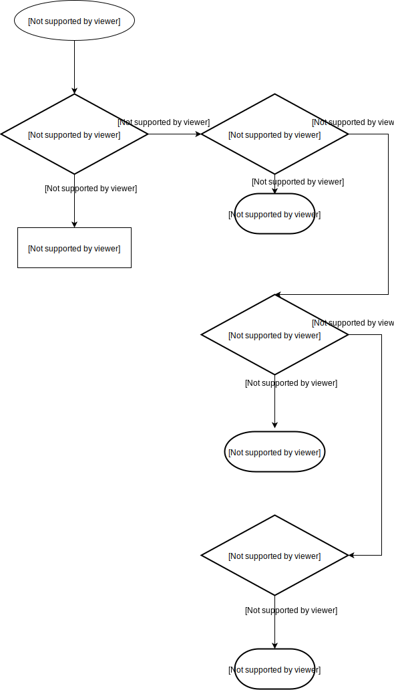
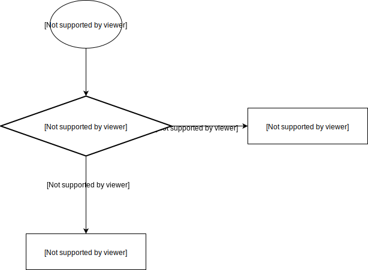
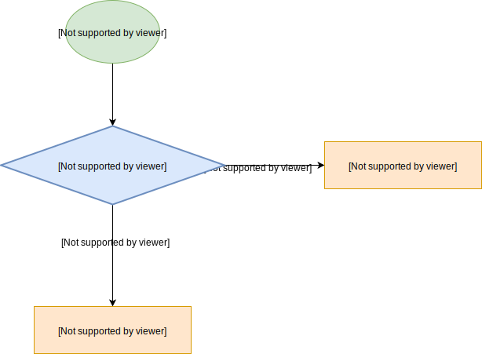
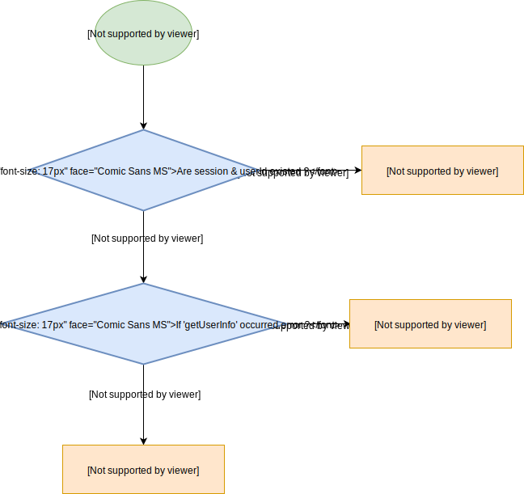
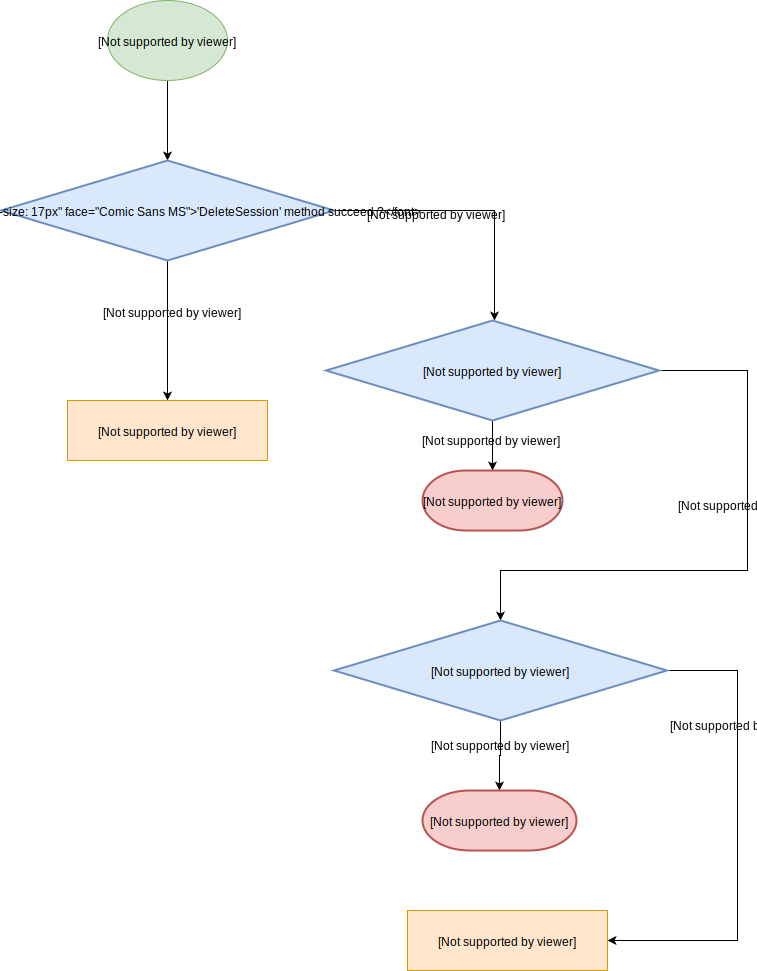
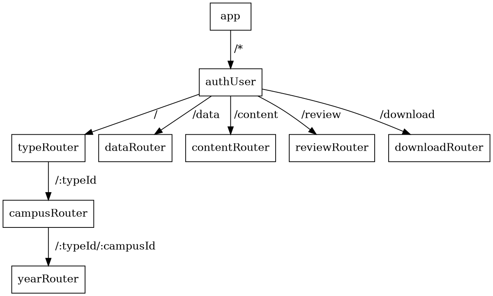
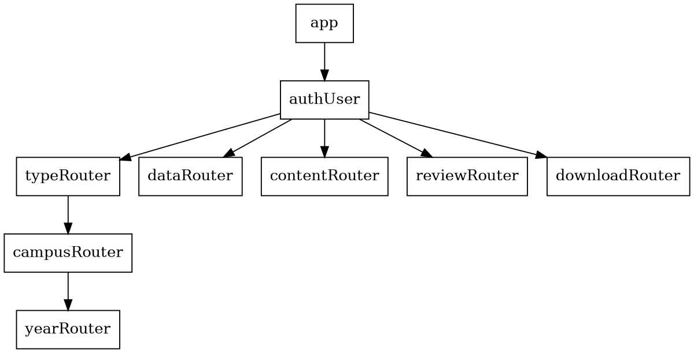

# Selection Web
A website which is for management and data marker.

# Prerequisite
- Node js
    - Express
- Sequelize
- HTML/CSS
    - Pug
    - Scss
- Webpack

<a href='#auth_models'>auth/models</a>

# Hierarachy of Selection web
```bash
selection_Web/
├── data
├── auth
├── mid-long-term
├── short-term
├── doc
└── lib
```
This project has three apps, named `auth`, `mid-long-term`, `short-term`, respectively.

# `auth`
The `auth` app handles the operation of login.

```bash
auth
├── models
│   ├── operations
│   └── schemas
├── public
│   ├── javascripts
│   └── stylesheets
├── static
│   ├── javascripts
│   └── stylesheets
│       └── component
├── views
│   └── mixins
└── app.js
```
- links
    - <a href="#auth_models"> models </a>
    - <a href="#auth_public"> public </a>
    - <a href="#auth_static"> static </a>
    - <a href="#auth_views"> views </a>
    - <a href="#auth_app"> app.js </a>

<a id='auth_models'></a>
- `auth/models`

    - `models/operations`, which defines the connection between the database and server by using `Sequelize` modules.
        - [`connect.js`](https://hackmd.io/SHKrnas3SHOuMzQ6nbZK1w?both)
        - [`sync-session.js`](https://hackmd.io/Ok-YiwE4SLeCf5f9ltTE5w)
        - [`delete-sission.js`](https://hackmd.io/Y03A1JwzReijkrYLZCfzcQ)
        - [`get-user-info.js`](https://hackmd.io/byoZCcCqSnCdF3GTKF_e5g?both)
        - [`login.js`](https://hackmd.io/sx3VxGASSaibHE4KvfvICg)
    - `models/schemas`, which defines the columns and properties of each column. We have schemas named `session` and `user`.
        - [`session.js`](https://hackmd.io/DQccnW8GSU6i6-XpGE9JIQ)
        - [`user.js`](https://hackmd.io/_7pcP-nHT3G8dl8ZSKUJgw)

<a id="auth_public"></a>
- `auth/public`
    - It is just the bundle of front-end code which is not readable.

<a id="auth_static"></a>
- `auth/static`

    - `auth/static/javascripts`
        - It defines the function of login and signup.
        - [`login.js`](https://hackmd.io/kw0LaJzeRjyIZy0-j0IXAQ)
        - [`signup.js`](https://hackmd.io/bEv5a2MCTi2XsW0CHvEkyA)

    - `auth/static/stylesheets`
        - It defines the exterior of the web page
        - `component/`
            - `_manage.scss`
            - `_style.scss`
        - `signup.css`
        - `login.css`
        - `signup.css`

<a id="auth_views"></a>
- `auth/views`
    - This defines the html of login web page and signup web page.

<a id="auth_app"></a>
- [`app.js`](https://hackmd.io/iBpjWIvnRqK8eAmIUpLDXQ#module_userApp..login)
    - This is the server, which defines the operation of login and signup.

    - Route
        - `POST /login` - only can be requested from GET `/login` page
        
        - `GET /login` - could be from any page
        
        - `/public` - could be from any page
        
        - `GET /channel` - could be from any page
        
        - `GET /logout` - could be get from `/channel`, `mid-long-term/` and `short-term/`
        

# `mid-long-term`
```bash
mid-long-term/
├── models
│   ├── operations
│   └── schemas
├── public
│   ├── javascripts
│   └── stylesheets
├── routes
├── static
│   ├── javascripts
│   │   ├── module
│   │   └── src
│   └── stylesheets
│       └── component
├── views
│    └── mixins
│        └── editnodes
└── app.js


```

- `mid-long-term/models`
    - `/operations`, which defines the connection between the database and server by using `Sequelize` modules and deines the operations to the database.
        - connection
            - [`connect.js`](https://hackmd.io/9ERaXWGLRCuxHzBtrFiGiA)
        - operations
            - [`content-auth.js`](https://hackmd.io/iiao7-TCTKqyx_VPizSxgw)
            - [`content-change-label.js`](https://hackmd.io/n_0lDpKORDKV_0BQGeFW0A)
            - [`content-create.js`](https://hackmd.io/Yjuql7JmTeOBSv6kswfObQ)
            - [`content-update.js`](https://hackmd.io/wJrvIgXzQH-psws782e3oA)
            - `content-filter.js`
            - [`data-create.js`](https://hackmd.io/5vrrDLjKS16q8Rxwht_8cg)
            - [`data-delete.js`](https://hackmd.io/CdTK5J6CSFiTkCf30wiNqQ)
            - [`download-csv.js`](https://hackmd.io/dHAEUp3KT9WU4eQ5YdpnuA)
            - `draw.js` (deprecated)
            - [`get-all-campus.js`](https://hackmd.io/nbl4ko22QYO1jV2NCBqstg)
            - `get-all-year.js`
            - `get-all-type.js`
            - `get-content.js`
    - `/schemas`
        - which defines the columns and properties of each column. We have schemas named `content` and `data`.
        - `data.js`
            - It represent the campus.
        - `content.js`
            - It represent the content of campus.

- `mid-long-term/public`
    - It is just the bundle of front-end code which is not readable.

- `mid-long-term/static`

    - `/javascripts`
        - It defines the function of creating new campus and buttons on the web page.

        - ```bash
            javascripts/
            ├── campus.js
            ├── draw.js
            ├── edit.js
            ├── module
            │   ├── projectCreation.js
            │   └── projectDelete.backup.js
            ├── review.js
            ├── src
            │   └── schema.js
            ├── type.js
            └── year.js
            ```

        - `campus.js`
            - Just import the `projectCreation.js`.

        - `draw.js` (deprecated)
            - Define the figure drew on the web page.
        - `edit.js`
            - Define the function of the  filter and dropdown button in the edit mode when the user owns the edit permission. Otherwise, the user only has the permission to read.
        - `module/`
            - `projectCreation.js`
                - It will be called when the users add a new campus to the database.
            - `projectDelete.backup.js`
                - It will be called when the users want to delete a campus(project)

        - `review.js`
            - Define the function of the filter and dropdown button in the read-only mode when the user doesn't own the edit permission.
        - `src/schema.js`
            - Containing a object with the label information.(It is used to control the dropdown button)
        - type.js
            - Import `projectCreation.js`.
        - year.js
            - Import `projectCreation.js` and the function of progress bar.

    - `/stylesheets`
        - It defines the exterior of the web page
        - `signup.css`
        - `login.css`
        - `signup.css`

    - `mid-long-term/routes`
        - All routes of controlling the logic of responding and requesting
        - Hierarachy
            - ```bash
                routes/
                ├── campus.js
                ├── content.js
                ├── data.js
                ├── downloadCsv.js
                ├── graph.js
                ├── index.js
                ├── review.js
                ├── type.js
                └── year.js
                ```
        - `campus.js` - `GET midLongTerm/:typeId`
            - Controll the logic in the campus web page(.scss).
            ```flow
                _campus=>start: midLongTerm/:typeId
                getAllCampus=>operation: Call getAllCampus in get-all-campus.js
                r_campus=>operation: Render campus.pug
                _campus->getAllCampus
                getAllCampus->r_campus
            ```
        - `content.js`-`midLongTerm/content`
            - Controll the logic in the edit web page(.scss).
            - `GET /save`
            ```flow
            _save=>start: /save
            _:dataId/add=>start: /:dataId/add

            contentSave=>operation: call contentSave method in content-save.js
            next=>operation: call next()

            _save->contentSave


            ```
            - `GET /delete`
            ```flow
            _delete=>start: /delete
            contentDelete=>operation: call contentDelete method in content-delete.js

            _delete->contentDelete
            ```
            - `GET /change`
            ```flow
            _change=>start: /change
            contentChangeLabel=>operation: call contentChangeLabel method in content-change-label.js
            _change->contentChangeLabel
            ```
            - `GET /:dataId` 
            ```flow
            _:dataId=>start: /:dataId
            dataIdIsNaN=>condition: Is dataId `NaN`?
            error=>operation: throw an Error
            next=>operation: call next()
            next_err=>operation: call next(err)
            _:dataId->dataIdIsNaN
            dataIdIsNaN(yes)->error
            dataIdIsNaN(no)->next
            error->next_err
            ```
            - `GET /:dataId/filter`
            ```flow
            _:dataId/filter=>start: /:dataId/filter
            getContent=>operation: call getContent in get-content.js
            empty_data=>condition: Return string `empty data`?
            r_own=>operation: Render own.pug
            r_empty=>operation: Send back an empty string ''
            _:dataId/filter->getContent
            getContent->empty_data
            empty_data(yes)->r_empty
            empty_data(no)->r_own
            ```
            - `GET /:dataId/check`
            ```flow
            _:dataId/check=>start: /:dataId/check
            getContent=>operation: call getContent in get-content.js
            empty_data=>condition: Return string `empty data`?
            r_check=>operation: Render check.pug
            r_empty=>operation: Send back an empty string ''
            _:dataId/check->getContent
            getContent->empty_data
            empty_data(yes)->r_empty
            empty_data(no)->r_check
            ```
            - `POST /:dataId/check`
            ```flow
            _:dataId/check=>start: /:dataId/check
            contentUpdate=>operation: call contentUpdate in content-update.js
            _:dataId/check->contentUpdate
            ```
            - `GET /:dataId/add`
            ```flow
            _:dataId/add=>start: /:dataId/add
            contentCreate=>operation: call contentCreate in cntent-create.js
            _:dataId/add->contentCreate
            ```
        - `data.js`
            - Controll the logic when the user add a new content or delete a content. And, it also has the function of rendering a edit web page when the users access the edit page.
            - `POST /add`
            ```flow
            _add=>start: /add
            dataCreate=>operation: call dataCreate in data-create.js
            r_:typeId/index=>operation: Redirect to migLongTerm/:typeId/index
            _add->dataCreate
            dataCreate->r_:typeId/index
            ```
            - `POST /delete`
            ```flow
            _delete=>start: /delete
            dataDelete=>operation: Call dataDelete in data-delete.js
            r_midLongTerm=>operation: Redirect to /midLongTerm/index
            _delete->dataDelete
            dataDelete->r_midLongTerm
            ```
            - `/:dataId`
            ```flow
            _:dataId=>start: /:dataId
            contentAuth=>operation: call contentAuth in content-auth.js
            asAReviewer=>condition: Return `as a reviewer`?
            r_review=>operation: Redirect to /reivew/:dataId/index
            next=>operation: call next()
            _:dataId->contentAuth
            contentAuth->asAReviewer
            asAReviewer(yes)->r_review
            asAReviewer(no)->next
            ```
            - `POST /:dataId/edit`- only could be requested from `year.pug`
            ```flow
            _:dataId/edit=>start: /:dataId/edit
            r_edit=>operation: Render edit.pug
            _:dataId/edit->r_edit
            ```
        - `downloadCsv.js`
            - Controll the logic when the user wants to download the current project into a csv file.
            - `downloadCsv/:dataId/index`
            ```flow
            _d_index=>start: downloadCsv/:dataId/index
            createCsv=>operation: Call createCsv method in create-csv.js
            sendFile=>operation: call res.sendFile()
            
            _d_index->createCsv
            createCsv->sendFile
            ```
        - `graph.js`
            - Controll the logic when the user wants to see the statistic result of the campus.
        - `index.js`
            - Just render the `type.pug` page to the client. 
        - `review.js`
            - Controll the logic of reviewer or editor. If the user is the owner, it will redirect to the `data.js`. Otherwise, it will render a `review.pug`
        - `type.js`
            - Sending the web page,`type.pug`, with all types of campuses to the client.
            - `/index`
            ```flow
            _index=>start: /index
            getAllType=>operation: Call getAllType in get-all-type.js
            r_type=>operation: Render type.pug
        
            _index->getAllType->r_type
            ```
        - `year.js`
            - Sending the web page, `year.pug`, with all years of campuses to the client.
            - `/index`
            ```flow
            _index=>start: /index
            getAllYear=>operation: Call getAllYear in get-all-year.js
            r_year=>operation: Render year.pug
        
            _index->getAllYear->r_year
            ```
    - `/views`
        - All web pages of mid-long-term are here.
        - Hierarachy
            - ```bash
                views
                ├── campus.pug
                ├── edit.pug
                ├── editwithfilter.pug
                ├── error.pug
                ├── graph.pug
                ├── mixins
                │   ├── _addbutton.pug
                │   ├── _breadcrumb.pug
                │   ├── editnodes
                │   │   ├── check.pug
                │   │   ├── newedit.pug
                │   │   ├── own.pug
                │   │   ├── packup
                │   │   └── review.pug
                │   ├── filter.pug
                │   ├── _filterthreefield.pug
                │   ├── layout.pug
                │   ├── _midlongcss.pug
                │   ├── _midlongjavascript.pug
                │   ├── _projectcreation.pug
                │   ├── _rendercampus.pug
                │   ├── _renderyear.pug
                │   └── _suredelete.pug
                ├── review.pug
                ├── type.pug
                └── year.pug
                ```
        - `campus.pus`
        - `edit.pus`
        - `editwithfilter.pug`
        - `error.pug`
        - `graph.pug`
        - `mixins/`
            - `_addbutton.pug`
            - `_breadcrumb.pug`
            - `editnodes/`
                - `check.pug`
                - `newedit.pug`
                - `own.pug`
                - `review.pug`
            - `filter.pug`
            - `_filterthreefield.pug`
            - `layout.pug`
            - `_midlongcss.pug`
            - `_midlongjavascript.pug`
            - `_projectcreation.pug`
            - `_rendercampus.pug`
            - `_renderyear.pug`
            - `_suredelete.pug`
            - `review.pug`
            - `type.pug`
            - `year.pug`
    - `app.js`
        - The main hub of all routes. It controll the flow of requesting and error handling.
        - This is the order of the routes

# short-term

```bash=
short-term
├── models
│   ├── operations
│   └── schemas
├── public
│   ├── javascripts
│   └── stylesheets
├── routes
├── static
│   ├── javascripts
│   │   ├── module
│   │   └── src
│   └── stylesheets
│       └── component
└── views
    └── mixins
        └── editnodes

```
- `short-term/models`
    - `/operations`, which defines the connection between the database and server by using `Sequelize` modules and deines the operations to the database.
        - connection
            - [`connect.js`](https://hackmd.io/9ERaXWGLRCuxHzBtrFiGiA)
        - operations
            - [`content-auth.js`](https://hackmd.io/iiao7-TCTKqyx_VPizSxgw)
            - [`content-change-label.js`](https://hackmd.io/n_0lDpKORDKV_0BQGeFW0A)
            - [`content-create.js`](https://hackmd.io/Yjuql7JmTeOBSv6kswfObQ)
            - [`content-update.js`](https://hackmd.io/wJrvIgXzQH-psws782e3oA)
            - [`data-create.js`](https://hackmd.io/5vrrDLjKS16q8Rxwht_8cg)
            - [`data-delete.js`](https://hackmd.io/CdTK5J6CSFiTkCf30wiNqQ)
            - [`download-csv.js`](https://hackmd.io/dHAEUp3KT9WU4eQ5YdpnuA)
            - `draw.js` (deprecated)
            - [`get-all-campus.js`](https://hackmd.io/nbl4ko22QYO1jV2NCBqstg)
            - [`get-all-year.js`](https://hackmd.io/EWG0hIs-SHug3h89SkVEzA)
            - [`get-all-type.js`](https://hackmd.io/R52LF6fJRBywRe12cAjalA)
            - [`get-content.js`](https://hackmd.io/4lyea_eIS-Osus-iYBKhZA)
    - `/schemas`
        - which defines the columns and properties of each column. We have schemas named `content` and `data`.
        - `data.js`
            - It represent the campus.
        - `content.js`
            - It represent the content of campus.

- `short-term/public`
    - It is just the bundle of front-end code which is not readable.

- `short-term/static`

    - `/javascripts` 
        - It defines the function of creating new campus and buttons on the web page.

        - ```bash
            javascripts/
            ├── campus.js
            ├── draw.js
            ├── edit.js
            ├── module
            │   ├── projectCreation.js
            │   └── projectDelete.backup.js
            ├── review.js
            ├── src
            │   └── schema.js
            ├── type.js
            └── year.js
            ```

        - `campus.js`
            - Just import the `projectCreation.js`.

        - `draw.js` (deprecated)
            - Define the figure drew on the web page.
        - `edit.js`
            - Define the function of the  filter and dropdown button in the edit mode when the user owns the edit permission. Otherwise, the user only has the permission to read.
        - `module/`
            - `projectCreation.js`
                - It will be called when the users add a new campus to the database. 
            - `projectDelete.backup.js`
                - It will be called when the users want to delete a campus(project)

        - `review.js`
            - Define the function of the filter and dropdown button in the read-only mode when the user doesn't own the edit permission.
        - `src/schema.js`
            - Containing a object with the label information.(It is used to control the dropdown button)
        - type.js
            - Import `projectCreation.js`.
        - year.js
            - Import `projectCreation.js` and the function of progress bar.
        
    - `/stylesheets`
        - It defines the exterior of the web page
        - `signup.css`
        - `login.css`
        - `signup.css`

    - `short-term/routes`
        - All routes of controlling the logic of responding and requesting
        - Hierarachy
            - ```bash 
                routes/
                ├── campus.js
                ├── content.js
                ├── data.js
                ├── downloadCsv.js
                ├── graph.js
                ├── index.js
                ├── review.js
                ├── type.js
                └── year.js
                ```
        - `campus.js`
            - Controll the logic in the campus web page(.scss).
        - `content.js`
            - Controll the logic in the edit web page(.scss).
        - `data.js`
            - Controll the logic when the user add a new content or delete a content. And, it also has the function of rendering a edit web page when the users access the edit page.
        - `downloadCsv.js`
            - Controll the logic when the user wants to download the current project into a csv file.
        - `graph.js`
            - Controll the logic when the user wants to see the statistic result of the campus.
        - `index.js`
            - Just render the `type.pug` page to the client. 
        - `review.js`
            - Controll the logic of reviewer or editor. If the user is the owner, it will redirect to the `data.js`. Otherwise, it will render a `review.pug`
        - `type.js`
            - Sending the web page,`type.pug`, with all types of campuses to the client.
        - `year.js`
            - Sending the web page, `year.pug`, with all years of campuses to the client.
    - `/views`
        - All web pages of mid-long-term are here.
        - Hierarachy
            - ```bash
                views
                ├── campus.pug
                ├── edit.pug
                ├── editwithfilter.pug
                ├── error.pug
                ├── graph.pug
                ├── mixins
                │   ├── _addbutton.pug
                │   ├── _breadcrumb.pug
                │   ├── editnodes
                │   │   ├── check.pug
                │   │   ├── newedit.pug
                │   │   ├── own.pug
                │   │   ├── packup
                │   │   └── review.pug
                │   ├── filter.pug
                │   ├── _filterthreefield.pug
                │   ├── layout.pug
                │   ├── _midlongcss.pug
                │   ├── _midlongjavascript.pug
                │   ├── _projectcreation.pug
                │   ├── _rendercampus.pug
                │   ├── _renderyear.pug
                │   └── _suredelete.pug
                ├── review.pug
                ├── type.pug
                └── year.pug
                ```
        - `campus.pus`
        - `edit.pus`
        - `editwithfilter.pug`
        - `error.pug`
        - `graph.pug`
        - `mixins/`
            - `_addbutton.pug`
            - `_breadcrumb.pug`
            - `editnodes/`
                - `check.pug`
                - `newedit.pug`
                - `own.pug`
                - `review.pug`
            - `filter.pug`
            - `_filterthreefield.pug`
            - `layout.pug`
            - `_midlongcss.pug`
            - `_midlongjavascript.pug`
            - `_projectcreation.pug`
            - `_rendercampus.pug`
            - `_renderyear.pug`
            - `_suredelete.pug`
            - `review.pug`
            - `type.pug`
            - `year.pug`
    - `app.js`
        - The main hub of all routes. It controll the flow of requesting and error handling.
        - This is the order of the routes

